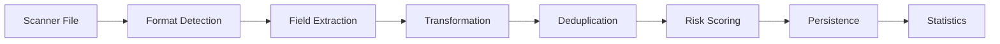

# Risk Radar Product Requirements Document (MVP)

## Table of Contents
1. [Executive Summary](#executive-summary)
2. [Features Overview](#features-overview)
3. [System Architecture](#system-architecture)
4. [Core Data Model](#core-data-model)
5. [Feature Specifications](#feature-specifications)
6. [Ingestion Architecture](#ingestion-architecture)
7. [Implementation Guide](#implementation-guide)
8. [Non-Functional Requirements](#non-functional-requirements)
9. [Appendices](#appendices)

---

## Executive Summary

Risk Radar is a comprehensive vulnerability management platform that consolidates security data from multiple sources, prioritises risks based on business context, and tracks remediation efforts. The platform uses a flexible, configuration-driven architecture that enables integration with any vulnerability scanner without code changes.

### Core Value Propositions
- **Multi-Scanner Support**: Integrate any vulnerability scanner through configuration, not code
- **Intelligent Deduplication**: Sophisticated asset and vulnerability correlation across sources
- **Business Context**: Risk scoring based on asset criticality and organisational structure
- **Remediation Tracking**: Campaign management with SLA enforcement and performance metrics
- **Extensibility**: Schema designed for evolution without migrations

---

## Features Overview

Risk Radar provides a comprehensive vulnerability management platform with features designed to streamline security operations from discovery through remediation. Based on industry best practices exemplified by [Vulcan Cyber ExposureOS](https://help.vulcancyber.com/en/), the platform delivers the following capabilities:

### 🔍 Discovery & Ingestion
- **Multi-Scanner Support**: Integrate any vulnerability scanner through configuration-driven field mappings
- **Automated Asset Discovery**: Continuous asset inventory updates from multiple sources
- **Smart Deduplication**: Sophisticated correlation logic prevents duplicate assets and vulnerabilities
- **File Upload Interface**: Direct upload of scanner reports (Nessus, Qualys, etc.)
- **Real-time Sync**: Automated connector scheduling with activity logging

### 📊 Risk Management
- **Business Context Integration**: Business Groups and Asset Tags for organisational alignment
- **Dynamic Risk Scoring**: Multi-factor risk calculation combining severity, threats, and business impact
- **Threat Intelligence**: Integration with exploit databases and threat feeds
- **Vulnerability Prioritisation**: VPR-style scoring beyond basic CVSS
- **Custom Risk Weights**: Configurable importance factors for your environment

### 🎯 Asset Management
- **Unified Asset Inventory**: Single source of truth across all scanners
- **Multi-Type Support**: Hosts, websites, code repositories, containers, cloud resources
- **Advanced Deduplication**: Priority-based matching (cloud ID → agent UUID → MAC → hostname → IP)
- **Proactive Detach**: Automatic splitting of incorrectly merged assets
- **Dynamic Properties**: Custom metadata and ownership assignment

### 📈 Analytics & Reporting
- **Executive Dashboard**: Real-time KPIs and risk trends
- **MTTR Analytics**: Mean Time to Remediate by severity, group, and asset type
- **SLA Compliance**: Track performance against defined service levels
- **Remediation Velocity**: Daily/weekly/monthly fix rates and capacity analysis
- **Custom Reports**: Self-service report builder with export capabilities
- **Trend Analysis**: Historical comparisons with improvement tracking

### 🔧 Remediation Management
- **Campaign Tracking**: Group remediation efforts with progress monitoring
- **Ticketing Integration**: JIRA, ServiceNow, Azure Boards connectors
- **Remediation Work Form**: External user interface for collaboration
- **Bulk Operations**: Mass status updates and assignments
- **Due Date Management**: SLA-driven or manual deadline setting
- **Fix Verification**: Automatic closure when vulnerabilities remediated

### 🤖 Automation & Workflows
- **Playbook Engine**: Condition-based automation for routine tasks
- **Auto-Ticketing**: Create tickets based on vulnerability criteria
- **Smart Updates**: Append new findings to existing tickets
- **Notification System**: Email/Slack alerts for critical events
- **Scheduled Actions**: Time-based automation triggers

### 🛡️ Compliance & Governance
- **Exception Requests**: Risk acceptance workflow with approvals
- **Audit Trail**: Complete activity logging for compliance
- **Role-Based Access**: Granular permissions by business group
- **SLA Policies**: Configurable by severity and business group
- **Compliance Reports**: Pre-built templates for common frameworks

### 🔐 Security & Administration
- **SSO Integration**: SAML/OIDC support for enterprise authentication
- **Row-Level Security**: Database-enforced access controls
- **API Access**: RESTful APIs for integration and automation
- **Multi-Tenancy**: Logical separation of business units
- **Backup & Recovery**: Automated backup with point-in-time recovery

---

## MVP Feature Matrix

The following table outlines which features will be implemented in the MVP phase versus future releases:

| Feature Category | Feature | MVP | Future | Notes |
|-----------------|---------|-----|---------|-------|
| **Discovery & Ingestion** | | | | |
| | Nessus file upload & parsing | ✅ | | Core MVP requirement |
| | Qualys integration | ❌ | ✅ | Phase 3 |
| | CrowdStrike integration | ❌ | ✅ | Phase 3 |
| | Real-time connector sync | ❌ | ✅ | Manual upload only in MVP |
| | Connector activity logging | ✅ | | Basic logging via Django |
| **Risk Management** | | | | |
| | Basic risk scoring (severity-based) | ✅ | | Simplified formula |
| | Threat intelligence integration | ❌ | ✅ | Phase 4 |
| | Custom risk weights | ✅ | | Via Django admin |
| | VPR-style scoring | ❌ | ✅ | CVSS only in MVP |
| **Asset Management** | | | | |
| | Asset CRUD operations | ✅ | | Via Supabase direct access |
| | Basic deduplication | ✅ | | Hostname + IP matching |
| | Advanced deduplication | ❌ | ✅ | Full algorithm in Phase 2 |
| | Proactive detach | ❌ | ✅ | Phase 3 |
| | Business Groups | ✅ | | Essential for MVP |
| | Asset Tags | ✅ | | Manual tagging only |
| | Dynamic properties | ❌ | ✅ | Phase 4 |
| **Analytics & Reporting** | | | | |
| | Basic dashboard | ✅ | | Key metrics only |
| | MTTR reporting | ✅ | | Core KPI |
| | SLA compliance tracking | ✅ | | Basic implementation |
| | Remediation velocity | ❌ | ✅ | Phase 3 |
| | Custom report builder | ❌ | ✅ | Phase 5 |
| | Export to CSV | ✅ | | Basic export |
| **Remediation Management** | | | | |
| | Manual status updates | ✅ | | Via Supabase UI |
| | Campaign management | ❌ | ✅ | Phase 4 |
| | Ticketing integration | ❌ | ✅ | Phase 4 |
| | Bulk operations | ✅ | | Basic bulk update |
| | Fix verification | ✅ | | Status tracking only |
| **Automation** | | | | |
| | Playbook engine | ❌ | ✅ | Phase 5 |
| | Auto-ticketing | ❌ | ✅ | Phase 5 |
| | Email notifications | ❌ | ✅ | Phase 4 |
| | Scheduled imports | ❌ | ✅ | Phase 3 |
| **Compliance** | | | | |
| | Exception requests | ❌ | ✅ | Phase 4 |
| | Basic audit logging | ✅ | | Django logging |
| | Advanced audit trail | ❌ | ✅ | Phase 5 |
| | Compliance reports | ❌ | ✅ | Phase 5 |
| **Security & Admin** | | | | |
| | JWT authentication | ✅ | | Via Supabase |
| | Row-level security | ✅ | | Supabase RLS |
| | Basic role management | ✅ | | Admin/User roles |
| | Advanced RBAC | ❌ | ✅ | Phase 5 |
| | SSO integration | ❌ | ✅ | Phase 6 |
| | REST API (minimal) | ✅ | | Upload & reports only |
| | Full REST API | ❌ | ✅ | Phase 7 |
| **UI/UX** | | | | |
| | lovable.dev UI | ✅ | | Rapid development |
| | Mobile responsive | ✅ | | Built-in with lovable |
| | Dark mode | ❌ | ✅ | Future enhancement |
| | Custom branding | ❌ | ✅ | Enterprise feature |

### MVP Success Criteria
The MVP will be considered successful when it can:
1. ✅ Import and parse Nessus scan files
2. ✅ Display vulnerabilities and affected assets with filtering
3. ✅ Calculate basic risk scores
4. ✅ Track remediation progress with status updates
5. ✅ Show MTTR and SLA compliance metrics
6. ✅ Support business groups for organisational context
7. ✅ Provide basic user access control
8. ✅ Export data for external reporting

---

## System Architecture

### Technical Stack (Hybrid Architecture)
- **Database**: PostgreSQL (managed by Supabase) with JSONB for extensibility
- **Authentication**: Supabase Auth with JWT tokens
- **Storage**: Supabase Storage for scanner files
- **Direct CRUD**: Supabase auto-generated APIs for basic operations
- **Complex Logic**: Django for parsing, risk calculation, reporting
- **Frontend**: lovable.dev for rapid UI development
- **Background Jobs**: Django-Q with Redis for async processing

### MVP Architecture Philosophy
The MVP leverages Supabase's capabilities to minimise backend development:
- **Direct Database Access**: lovable.dev connects directly to Supabase for most CRUD operations
- **Row Level Security**: Supabase RLS policies handle data access control
- **Minimal API Surface**: Django provides endpoints only for complex operations that can't be handled by direct DB access
- **Rapid Development**: lovable.dev's visual builder accelerates UI creation

### Data Flow Architecture
```
┌─────────────────┐     ┌────────────────┐     ┌──────────────────┐
│ Scanner Sources │────▶│ Django         │────▶│ PostgreSQL       │
│ (Nessus files) │     │ (Parser)       │     │ (Supabase)       │
└─────────────────┘     └────────────────┘     └──────────────────┘
                                                       │
                                                       ▼
                        ┌────────────────┐      ┌──────────────────┐
                        │ Supabase Auth  │      │ lovable.dev UI   │
                        │ & Storage      │◀────▶│ - Direct DB CRUD │
                        └────────────────┘      │ - Django APIs    │
                                                └──────────────────┘
```

### Django API Endpoints (MVP - Minimal Set)
```
# File Operations
POST   /api/v1/upload/nessus        # Upload & parse Nessus file

# Complex Operations  
POST   /api/v1/risk/calculate       # Recalculate risk scores
GET    /api/v1/reports/sla          # SLA compliance report
GET    /api/v1/reports/mttr         # MTTR metrics
POST   /api/v1/campaigns/create     # Create remediation campaign

# All other CRUD operations handled directly via Supabase
```

---

## Core Data Model

### Schema Overview
The schema centres on separate tables for assets, vulnerabilities, and findings to normalise data and avoid duplication. A scanner_integration table lists all configured integrations, while field_mapping and severity_mapping tables provide flexible mapping from vendor-specific fields and severity ratings to the internal schema.

### 3.1 Scanner Integration Table

> **Note**: Enhanced as of 2025-01-02 to include default asset category assignment for improved scanner-specific asset classification.

#### Enhanced Implementation (Current)
```sql
CREATE TABLE scanner_integration (
    integration_id SERIAL PRIMARY KEY,
    name VARCHAR(100) NOT NULL UNIQUE,
    type VARCHAR(50) NOT NULL DEFAULT 'vuln_scanner',  -- e.g., 'vuln_scanner', 'asset_inventory'
    default_asset_category_id INTEGER REFERENCES asset_category(category_id) ON DELETE SET NULL,
    version VARCHAR(50),
    description TEXT,
    is_active BOOLEAN DEFAULT TRUE,
    created_at TIMESTAMPTZ DEFAULT NOW()
);
```

#### Legacy Design (Reference)
```sql
CREATE TABLE scanner_integration (
    integration_id SERIAL PRIMARY KEY,
    name VARCHAR(100) NOT NULL UNIQUE,
    type VARCHAR(50) NOT NULL,               -- e.g., 'vuln_scanner', 'asset_inventory'
    description TEXT,
    active BOOLEAN DEFAULT TRUE
);
```

**Purpose**: Lists each external scanner integration configured in the system. Enhanced to provide default asset categorisation based on scanner type.

**Enhanced Field Descriptions**:
- `integration_id`: Synthetic primary key used throughout the system
- `name`: Human-readable name (e.g., "Nessus", "Qualys VM", "CrowdStrike Falcon")
- `type`: Category of integration for future extensibility
- `default_asset_category_id`: Default category for assets from this scanner (e.g., Nessus defaults to "Host")
- `version`: Scanner version for compatibility tracking
- `description`: Optional text describing the integration or version
- `is_active`: Enables/disables data sync without removing configuration
- `created_at`: Timestamp for audit and tracking purposes

### 3.2 Asset Types Table

> **Note**: This section describes the original asset types design. As of 2025-01-02, this has been enhanced with the implementation of AssetCategory and AssetSubtype models providing 86 standard subtypes across 5 main categories. See CHANGES.md for full details.

#### Enhanced Implementation (Current)
```sql
CREATE TABLE asset_category (
    category_id SERIAL PRIMARY KEY,
    name VARCHAR(50) NOT NULL UNIQUE,
    description TEXT,
    created_at TIMESTAMPTZ DEFAULT NOW()
);

CREATE TABLE asset_subtype (
    subtype_id SERIAL PRIMARY KEY,
    category_id INTEGER NOT NULL REFERENCES asset_category(category_id),
    name VARCHAR(100) NOT NULL,
    cloud_provider VARCHAR(20),  -- AWS, Azure, GCP for Cloud Resource category
    description TEXT,
    created_at TIMESTAMPTZ DEFAULT NOW(),
    UNIQUE(category_id, name, cloud_provider)
);
```

**Current Categories**:
- `Host` (18 subtypes) - Physical servers, VMs, workstations, network devices, IoT
- `Code Project` (11 subtypes) - Repositories, application projects, libraries
- `Website` (6 subtypes) - Web applications, APIs, domains
- `Image` (8 subtypes) - Container images, VM images
- `Cloud Resource` (43 subtypes) - AWS/Azure/GCP resources with provider-specific classification

#### Legacy Design (Reference)
```sql
CREATE TABLE asset_types (
    asset_type_id SERIAL PRIMARY KEY,
    name VARCHAR(50) NOT NULL UNIQUE
);
```

**Purpose**: Originally defined basic asset types. Enhanced implementation provides sophisticated categorisation with provider-aware cloud resource classification and standardised subtypes from ASSET_TYPES.md specification.

### 3.3 Assets Table

> **Note**: This schema has been enhanced as of 2025-01-02 to include category and subtype foreign key references for sophisticated asset classification.

#### Enhanced Implementation (Current)
```sql
CREATE TABLE assets (
    asset_id SERIAL PRIMARY KEY,
    name VARCHAR(255) NOT NULL,
    hostname VARCHAR(255),
    ip_address INET,
    -- Enhanced categorisation
    category_id INTEGER NOT NULL REFERENCES asset_category(category_id) ON DELETE PROTECT,
    subtype_id INTEGER REFERENCES asset_subtype(subtype_id) ON DELETE SET NULL,
    -- Legacy compatibility
    asset_type_id INTEGER REFERENCES asset_types(asset_type_id) ON DELETE PROTECT,
    -- Enhanced fields
    operating_system VARCHAR(100),
    mac_address VARCHAR(50),
    extra JSONB DEFAULT '{}',
    created_at TIMESTAMPTZ DEFAULT NOW(),
    updated_at TIMESTAMPTZ DEFAULT NOW(),
    UNIQUE(hostname, ip_address)
);
```

#### Legacy Design (Reference)
```sql
CREATE TABLE assets (
    asset_id SERIAL PRIMARY KEY,
    hostname VARCHAR(255),
    ip_address INET,
    asset_type_id INTEGER NOT NULL REFERENCES asset_types(asset_type_id),
    operating_system VARCHAR(100),
    mac_address VARCHAR(50),
    extra JSONB,                    -- unstructured metadata (e.g., cloud IDs, tags)
    UNIQUE(hostname, ip_address)
);
```

**Purpose**: Stores unique IT assets discovered by scanners. Enhanced to support sophisticated categorisation while maintaining backward compatibility.

**Enhanced Field Descriptions**:
- `category_id`: Reference to AssetCategory (Host, Code Project, Website, Image, Cloud Resource)
- `subtype_id`: Reference to AssetSubtype (Server, Router, GitHub Repository, Docker Image, EC2 Instance, etc.)
- `asset_type_id`: Legacy field maintained for backward compatibility during migration
- `name`: Asset display name (auto-generated from hostname/IP if not provided)
- `hostname` / `ip_address`: Core identifiers with unique constraint for deduplication
- `operating_system`: Normalised OS name/version
- `mac_address`: Network interface identifier for correlation
- `extra`: Enhanced JSONB field storing:
  - `fqdn`: Fully qualified domain name
  - `netbios_name`: Windows NetBIOS name
  - `system_type`: Original scanner system type value
  - `scan_start_time` / `scan_end_time`: Scan timing metadata
  - Cloud identifiers (AWS instance ID, Azure VM ID, GCP instance ID)
  - Agent UUIDs
  - Scanner-specific attributes

**Deduplication Strategy**:
1. Cloud instance IDs (highest priority)
2. Agent UUIDs
3. MAC address + hostname
4. Hostname + primary IP
5. IP address only (lowest priority)

### 3.4 Vulnerabilities Table
```sql
CREATE TABLE vulnerabilities (
    vulnerability_id SERIAL PRIMARY KEY,
    cve_id VARCHAR(50),                     -- e.g., 'CVE-2023-12345'
    external_id VARCHAR(100),               -- scanner-specific vuln ID
    external_source VARCHAR(50),            -- source of external_id
    title TEXT NOT NULL,
    description TEXT,
    cvss_score NUMERIC(4,1),                -- CVSS base score 0.0-10.0
    severity_level SMALLINT,                -- normalised 0-10 scale
    severity_label VARCHAR(20),             -- normalised label
    fix_info TEXT,                          -- remediation advice
    published_at TIMESTAMPTZ,               -- vulnerability publication date
    modified_at TIMESTAMPTZ,                -- last update date
    extra JSONB,                            -- extensible metadata
    UNIQUE(cve_id),
    UNIQUE(external_source, external_id)
);
```

**Purpose**: Centralised vulnerability catalogue with normalised severity and deduplication support.

**Field Descriptions**:
- `cve_id`: Standard CVE identifier for cross-scanner deduplication
- `external_id` & `external_source`: Scanner-specific identifiers (e.g., Nessus pluginID, Qualys QID)
- `title`: Short, descriptive name
- `description`: Full vulnerability details
- `cvss_score`: Industry-standard severity metric
- `severity_level` & `severity_label`: Normalised internal severity (via severity_mapping)
- `fix_info`: Remediation instructions
- `published_at` / `modified_at`: Temporal tracking
- `extra`: JSONB for extensible data:
  - Exploit availability flags
  - Reference URLs (BID, OSVDB, vendor advisories)
  - CWE IDs
  - Scanner-specific metadata

### 3.5 Findings Table
```sql
CREATE TABLE findings (
    finding_id SERIAL PRIMARY KEY,
    asset_id INTEGER NOT NULL REFERENCES assets(asset_id) ON DELETE CASCADE,
    vulnerability_id INTEGER NOT NULL REFERENCES vulnerabilities(vulnerability_id) ON DELETE CASCADE,
    integration_id INTEGER NOT NULL REFERENCES scanner_integration(integration_id) ON DELETE CASCADE,
    first_seen TIMESTAMP,
    last_seen TIMESTAMP,
    fixed_at TIMESTAMP,
    status VARCHAR(20) DEFAULT 'open',      -- 'open', 'fixed', 'risk_accepted'
    severity_level SMALLINT,                -- normalised severity at finding level
    port VARCHAR(10),                       -- network port if applicable
    protocol VARCHAR(10),                   -- protocol if applicable
    service VARCHAR(100),                   -- service name
    risk_score NUMERIC(5,2),                -- calculated risk score
    details JSONB,                          -- scanner evidence & metadata
    UNIQUE(asset_id, vulnerability_id, integration_id, port, protocol, service)
);
```

**Purpose**: Links vulnerabilities to assets with full context. Supports multiple scanners reporting the same issue.

**Field Descriptions**:
- `asset_id` / `vulnerability_id` / `integration_id`: Core relationships
- `first_seen` / `last_seen` / `fixed_at`: Temporal tracking for MTTR
- `status`: Lifecycle management (open → fixed/risk_accepted)
- `severity_level`: Can differ from vulnerability severity based on context
- `port` / `protocol` / `service`: Network context for service-specific vulnerabilities
- `risk_score`: Calculated based on severity, asset criticality, and threat intelligence
- `details`: JSONB for scanner-specific evidence:
  - Plugin output (Nessus)
  - Vulnerability test results (Qualys)
  - File paths (CrowdStrike)
  - Registry keys (Defender)

### 3.6 Field Mapping Table
```sql
CREATE TABLE field_mapping (
    mapping_id SERIAL PRIMARY KEY,
    integration_id INTEGER NOT NULL REFERENCES scanner_integration(integration_id) ON DELETE CASCADE,
    source_field VARCHAR(200) NOT NULL,     -- Scanner field name/path
    target_model VARCHAR(50) NOT NULL,      -- 'assets', 'vulnerabilities', 'findings'
    target_field VARCHAR(100) NOT NULL,     -- Model field or JSON path
    field_type VARCHAR(20) DEFAULT 'string',
    transformation VARCHAR(500),            -- Python expression or function
    default_value TEXT,
    is_required BOOLEAN DEFAULT FALSE,
    is_active BOOLEAN DEFAULT TRUE,
    sort_order INTEGER DEFAULT 0,
    UNIQUE (integration_id, source_field, target_model, target_field)
);
```

**Purpose**: Configuration-driven field extraction and transformation. Enables no-code scanner integration.

**Field Descriptions**:
- `source_field`: Exact field name from scanner (XML tag, JSON key, CSV column)
- `target_model` / `target_field`: Destination in internal schema
- `field_type`: Data type for conversion (string, integer, decimal, boolean, json, datetime)
- `transformation`: Python expression for complex mappings:
  - `value.lower()` - Convert to lowercase
  - `value.split(',')[0]` - Extract first element
  - `severity_map` - Use severity mapping table
- `default_value`: Fallback for missing data
- `sort_order`: Process fields in specific order for dependencies

### 3.7 Severity Mapping Table
```sql
CREATE TABLE severity_mapping (
    severity_mapping_id SERIAL PRIMARY KEY,
    integration_id INTEGER NOT NULL REFERENCES scanner_integration(integration_id) ON DELETE CASCADE,
    external_severity VARCHAR(50) NOT NULL,
    internal_severity_level SMALLINT NOT NULL,
    internal_severity_label VARCHAR(20) NOT NULL,
    UNIQUE(integration_id, external_severity)
);
```

**Purpose**: Normalises different scanner severity scales to consistent internal ratings.

### Schema Validation

#### Multi-Scanner Support Validation
The schema design has been validated against [Vulcan Cyber's](https://help.vulcancyber.com/) connector documentation for major vulnerability scanners:
- ✅ **Qualys VM** - All required fields mappable
- ✅ **Tenable.io/Nessus** - Complete field coverage confirmed
- ✅ **CrowdStrike Falcon** - Agent-based findings supported
- ✅ **Microsoft Defender VM** - Host vulnerability data compatible

#### Key Validation Findings
1. **Identification Strategy**: Our multi-identifier approach (cloud ID → agent UUID → MAC → hostname → IP) matches industry best practices
2. **JSONB Flexibility**: Aligns with Vulcan's approach for handling vendor-specific fields without schema changes
3. **Normalisation Framework**: field_mapping and severity_mapping tables enable configuration-driven integration
4. **Nessus MVP**: All fields from the [Nessus file format](https://docs.tenable.com/quick-reference/nessus-file-format/Nessus-File-Format.pdf) are fully supported

The schema is **production-ready** for the MVP and future scanner integrations.

---

## Feature Specifications

This section details the core features that will be implemented in the MVP, focusing on the essential capabilities needed for a functional vulnerability management platform.

### 4.1 Asset Management & Deduplication

#### Core Functionality (MVP)
- **Asset Types**: Support for hosts (physical/virtual servers, workstations)
- **Basic Deduplication**: Match assets by hostname + IP combination
- **Manual Tagging**: Add tags via UI for categorisation
- **Business Groups**: Assign assets to organisational units
- **CRUD Operations**: Direct database operations via Supabase

#### Deduplication Algorithm (Simplified for MVP)
```python
# MVP implementation - basic matching only
def deduplicate_asset_mvp(incoming_asset):
    # Simple hostname + IP matching
    if incoming_asset.hostname and incoming_asset.ip_address:
        existing = find_by_hostname_ip(incoming_asset.hostname, 
                                     incoming_asset.ip_address)
        if existing:
            return merge_assets(existing, incoming_asset)
    
    # Create new asset if no match
    return create_asset(incoming_asset)
```

#### Future Enhancements
The full deduplication algorithm with cloud IDs, agent UUIDs, and MAC addresses will be implemented post-MVP as shown in the original specification.

### 4.2 Vulnerability Management

#### MVP Implementation
- **CVE Tracking**: Store and deduplicate by CVE identifier
- **Basic Severity**: Use CVSS scores from scanners
- **Scanner Mapping**: Nessus plugin IDs via field_mapping table
- **Status Tracking**: Open, Fixed, Risk Accepted states

#### Severity Normalisation (MVP)
Simple mapping to 4 levels:
- Critical: CVSS 9.0-10.0
- High: CVSS 7.0-8.9
- Medium: CVSS 4.0-6.9
- Low: CVSS 0.0-3.9

### 4.3 Risk Scoring (Simplified for MVP)

#### MVP Formula
```
Risk Score = CVSS Score × Business Group Criticality

Where:
- CVSS Score = 0-10 from scanner
- Business Group Criticality = 1.0 (normal) or 1.5 (critical)
```

#### Future Enhancement
Post-MVP will implement the full formula with threat intelligence and multi-factor scoring as originally specified.

### 4.4 Business Groups & Asset Tagging

#### MVP Features
- **Create Business Groups**: Via Django admin or Supabase UI
- **Assign Criticality**: Normal or Critical designation
- **Asset Assignment**: Manual assignment through UI
- **Tag Creation**: Free-form tags for filtering
- **Basic Filtering**: Filter all views by business group

#### Supported Asset Types (MVP)
- **Hosts Only**: Physical servers, VMs, workstations
- Future phases will add: Code projects, websites, containers, cloud resources

### 4.5 SLA Management (Basic MVP)

#### MVP Implementation
```json
{
  "sla_policies": [
    {
      "severity": "Critical",
      "days": 7,
      "business_group": "all"
    },
    {
      "severity": "High", 
      "days": 30,
      "business_group": "all"
    }
  ]
}
```

#### Compliance Tracking
- **Simple Status**: Within SLA / Overdue
- **Basic Reporting**: Count and percentage compliance
- **Manual Configuration**: Via Django admin

### 4.6 Remediation Tracking (MVP)

#### Basic Features
- **Status Updates**: Mark findings as fixed/risk accepted
- **Bulk Operations**: Update multiple findings at once
- **Progress Tracking**: Simple percentage complete
- **Export**: CSV export of current status

#### Not in MVP
- Campaign management
- Ticketing integration
- Automated workflows
- Remediation work forms

### 4.7 Reporting & Analytics

#### MVP Reports

##### Dashboard Widgets
1. **Summary Stats**
   - Total vulnerabilities by severity
   - Total assets
   - Findings past SLA
   - Overall risk score

2. **MTTR Report**
   - Average days to remediate
   - By severity level
   - By business group
   - Last 30/60/90 days

3. **SLA Compliance**
   - Percentage meeting SLA
   - Count overdue by severity
   - Trend chart (simple)

4. **Top Risks**
   - Most critical vulnerabilities
   - Most affected assets
   - Highest risk business groups

##### Data Access
- **Direct SQL**: Supabase allows direct SQL queries
- **CSV Export**: All data exportable
- **Real-time**: Live data, no batch processing

#### Future Analytics
Post-MVP phases will add:
- Remediation velocity metrics
- Capacity planning
- Custom report builder
- Executive PowerBI-style dashboards
- Automated report distribution

---

## Ingestion Architecture

### 5.1 Processing Pipeline



### 5.2 Field Mapping Examples

#### Nessus to Risk Radar
```sql
-- Asset mappings
INSERT INTO field_mapping (integration_id, source_field, target_model, target_field) VALUES
(1, 'HostName', 'assets', 'hostname'),
(1, 'host-ip', 'assets', 'ip_address'),
(1, 'operating-system', 'assets', 'operating_system'),
(1, 'mac-address', 'assets', 'mac_address'),
(1, 'netbios-name', 'assets', 'extra.netbios_name'),
(1, 'host-fqdn', 'assets', 'extra.fqdn');

-- Vulnerability mappings
INSERT INTO field_mapping (integration_id, source_field, target_model, target_field, transformation) VALUES
(1, '@pluginID', 'vulnerabilities', 'external_id', NULL),
(1, '@pluginName', 'vulnerabilities', 'title', NULL),
(1, 'synopsis', 'vulnerabilities', 'extra.synopsis', NULL),
(1, 'description', 'vulnerabilities', 'description', NULL),
(1, 'solution', 'vulnerabilities', 'fix_info', NULL),
(1, '@severity', 'vulnerabilities', 'severity_level', 'severity_map'),
(1, 'risk_factor', 'vulnerabilities', 'extra.risk_factor', NULL),
(1, 'pluginFamily', 'vulnerabilities', 'extra.plugin_family', NULL);

-- CVE and Reference mappings
INSERT INTO field_mapping (integration_id, source_field, target_model, target_field, transformation) VALUES
(1, 'cve', 'vulnerabilities', 'cve_id', 'first'),  -- Take first CVE if multiple
(1, 'cve', 'vulnerabilities', 'extra.references.cve', 'list'),
(1, 'bid', 'vulnerabilities', 'extra.references.bid', 'list'),
(1, 'xref', 'vulnerabilities', 'extra.references.xref', 'list'),
(1, 'see_also', 'vulnerabilities', 'extra.references.see_also', 'list');

-- CVSS mappings
INSERT INTO field_mapping (integration_id, source_field, target_model, target_field) VALUES
(1, 'cvss_base_score', 'vulnerabilities', 'cvss_score', NULL),
(1, 'cvss_vector', 'vulnerabilities', 'extra.cvss.vector', NULL),
(1, 'cvss_temporal_score', 'vulnerabilities', 'extra.cvss.temporal_score', NULL),
(1, 'cvss_temporal_vector', 'vulnerabilities', 'extra.cvss.temporal_vector', NULL),
(1, 'cvss3_base_score', 'vulnerabilities', 'extra.cvss.cvss3_base_score', NULL),
(1, 'cvss3_vector', 'vulnerabilities', 'extra.cvss.cvss3_vector', NULL);

-- Exploit mappings
INSERT INTO field_mapping (integration_id, source_field, target_model, target_field) VALUES
(1, 'exploitability_ease', 'vulnerabilities', 'extra.exploit.exploitability_ease', NULL),
(1, 'exploit_available', 'vulnerabilities', 'extra.exploit.exploit_available', 'boolean'),
(1, 'exploit_framework_canvas', 'vulnerabilities', 'extra.exploit.canvas', 'boolean'),
(1, 'exploit_framework_metasploit', 'vulnerabilities', 'extra.exploit.metasploit', 'boolean'),
(1, 'exploit_framework_core', 'vulnerabilities', 'extra.exploit.core', 'boolean'),
(1, 'exploited_by_malware', 'vulnerabilities', 'extra.exploit.exploited_by_malware', 'boolean'),
(1, 'metasploit_name', 'vulnerabilities', 'extra.exploit.metasploit_name', NULL),
(1, 'canvas_package', 'vulnerabilities', 'extra.exploit.canvas_package', NULL);

-- Date mappings
INSERT INTO field_mapping (integration_id, source_field, target_model, target_field, transformation) VALUES
(1, 'vuln_publication_date', 'vulnerabilities', 'published_at', 'parse_date'),
(1, 'plugin_modification_date', 'vulnerabilities', 'modified_at', 'parse_date'),
(1, 'plugin_publication_date', 'vulnerabilities', 'extra.plugin_publication_date', 'parse_date'),
(1, 'patch_publication_date', 'vulnerabilities', 'extra.patch_publication_date', 'parse_date');

-- Finding mappings
INSERT INTO field_mapping (integration_id, source_field, target_model, target_field, transformation) VALUES
(1, '@port', 'findings', 'port', NULL),
(1, '@protocol', 'findings', 'protocol', NULL),
(1, '@svc_name', 'findings', 'service', NULL),
(1, 'plugin_output', 'findings', 'details.plugin_output', NULL),
(1, 'plugin_type', 'findings', 'details.plugin_type', NULL),
(1, 'script_version', 'findings', 'details.script_version', NULL);
```

#### Qualys to Risk Radar
```sql
-- Similar structure with Qualys-specific fields
INSERT INTO field_mapping (integration_id, source_field, target_model, target_field) VALUES
(2, 'QID', 'vulnerabilities', 'external_id'),
(2, 'IP', 'assets', 'ip_address'),
(2, 'DNS', 'assets', 'hostname'),
(2, 'OS', 'assets', 'operating_system');
```

### 5.3 Severity Mapping Examples

#### Nessus Severity Mapping
```sql
INSERT INTO severity_mapping (integration_id, external_severity, internal_severity_level, internal_severity_label) VALUES
(1, '4', 10, 'Critical'),
(1, '3', 8, 'High'),
(1, '2', 5, 'Medium'),
(1, '1', 3, 'Low'),
(1, '0', 0, 'Informational');
```

#### Qualys Severity Mapping
```sql
INSERT INTO severity_mapping (integration_id, external_severity, internal_severity_level, internal_severity_label) VALUES
(2, '5', 10, 'Critical'),
(2, '4', 8, 'High'),
(2, '3', 5, 'Medium'),
(2, '2', 3, 'Low'),
(2, '1', 1, 'Informational');
```

---

## Implementation Guide

### 7.1 Current Implementation Status (2025-01-02)

#### ✅ **COMPLETED** (feature/core-mvp - Ready to Merge)

**Database & Schema:**
- ✅ Complete PostgreSQL schema with 7 migrations
- ✅ Enhanced asset type system (5 categories, 86 subtypes)
- ✅ Multi-scanner support schema (migrations 0006 & 0007)
- ✅ Field mapping and severity mapping tables
- ✅ All core tables: Assets, Vulnerabilities, Findings, Categories, Subtypes

**Django Backend:**
- ✅ Complete Django project structure (28 Python files)
- ✅ Full models.py implementation (356 lines)
- ✅ Enhanced admin interface with category/subtype management
- ✅ Complete Nessus parser (513 lines) with enhanced asset type detection
- ✅ 6 management commands for setup and data operations
- ✅ Successfully tested imports (7 assets, 48 findings)

**Data Processing:**
- ✅ Database-driven field mapping engine
- ✅ System-type to subtype transformation (e.g., "general-purpose" → "Server")
- ✅ Enhanced field mappings (fqdn, netbios_name, cloud IDs, scan times)
- ✅ Asset deduplication with category support
- ✅ Vulnerability deduplication by CVE/plugin ID

#### ❌ **PENDING** (Upcoming Branches)

**Phase 1A: Django Upload API** (`feature/django-upload-api`)
- ❌ Django API endpoints (views.py currently only 4 lines)
- ❌ POST /api/upload/nessus endpoint
- ❌ File upload handling and validation
- ❌ URL routing configuration
- ❌ CORS configuration

**Phase 1B: Cloud Infrastructure** (`feature/lovable-ui-supabase`)
- ❌ Supabase project setup
- ❌ Schema deployment to Supabase
- ❌ Authentication configuration
- ❌ Storage bucket setup
- ❌ Row Level Security (RLS) policies
- ❌ lovable.dev UI connection to Supabase

**Phase 1C: Reporting APIs** (`feature/django-reporting-api`)
- ❌ GET /api/reports/mttr endpoint
- ❌ GET /api/reports/sla endpoint
- ❌ Migration from local PostgreSQL to Supabase

### 7.2 Implementation Roadmap

#### **Immediate Next Steps** (This Week)
```
Branch: feature/django-upload-api
Priority: High
Tasks:
- Create Django API views (replace 4-line views.py)
- Implement POST /api/upload/nessus endpoint
- Integrate with existing nessus_scanreport_import.py parser
- Add file validation and progress tracking
- Configure URL routing and CORS
```

#### **Phase 1B: Cloud Setup** (Next Week)
```
Branch: feature/lovable-ui-supabase
Priority: High
Tasks:
- Set up Supabase cloud project
- Deploy existing 7-migration schema to Supabase
- Configure authentication and storage
- Build basic upload UI in lovable.dev
- Test integration with Django upload endpoint
```

#### **Phase 1C: Reporting** (Week 3)
```
Branch: feature/django-reporting-api
Priority: Medium
Tasks:
- Implement MTTR calculation endpoints
- Implement SLA compliance endpoints
- Connect Django to Supabase database
- Test reporting with cloud data
```

### 7.2.1 Testing & Development Tools

The platform includes comprehensive testing and development tools organised in the `/commands` directory:

#### Testing Infrastructure (`/commands/testing/`)
- **API Authentication Testing**: `test_upload_api.py` validates JWT token handling
- **Upload Validation**: Tests both authenticated and unauthenticated file uploads
- **Error Scenario Testing**: Validates handling of invalid files and tokens
- **Environment Integration**: Automatically loads Supabase credentials from `.env`

#### Data Generation (`/commands/data_generation/`)
- **Synthetic Nessus Generation**: `generate_weekly_nessus_files.py` creates realistic test data
- **Progressive Data Simulation**: Multiple weeks with varying host/vulnerability counts
- **Scan Profile Simulation**: Production, DMZ, and development environments
- **Realistic Vulnerability Data**: Proper CVEs, plugin IDs, and CVSS scores

#### Usage Examples
```bash
# Test authentication implementation
cd commands/testing && python test_upload_api.py

# Generate test data for development
cd commands/data_generation && python generate_weekly_nessus_files.py
```

These tools are essential for:
- **Development Testing**: Validating authentication and upload functionality
- **Integration Testing**: End-to-end API testing with real data flows
- **Performance Testing**: Large datasets for load testing
- **Demo Preparation**: Consistent, realistic data for demonstrations

### 7.3 Original Phase Structure (Reference)

> **Note**: The original phase structure below is for reference. Actual implementation has progressed beyond the original timeline due to comprehensive backend development in feature/core-mvp.

#### ~~Phase 1: Infrastructure Setup (Days 1-3)~~ **COMPLETED**

---

## Non-Functional Requirements

### Performance
- **Data ingestion**: Process 100,000 findings in under 15 minutes
- **Query response**: Sub-second response for filtered finding lists
- **Concurrent users**: Support 100+ simultaneous users
- **Real-time updates**: Instant reflection of status changes

### Scalability
- **Horizontal scaling**: Stateless API servers
- **Database optimisation**: Proper indexing on foreign keys and commonly queried fields
- **Batch processing**: Chunked processing for large files
- **Archive strategy**: Move closed findings to archive tables after 90 days

### Security
- **Encryption at rest**: All sensitive fields encrypted
- **Encryption in transit**: TLS 1.2+ mandatory
- **Authentication**: JWT tokens with 1-hour expiry
- **Audit logging**: Every create/update/delete logged with user context

### Reliability
- **Availability**: 99.5% monthly uptime
- **Backup**: Daily automated backups with 30-day retention
- **Recovery**: RPO < 24 hours, RTO < 4 hours
- **Monitoring**: Application and infrastructure metrics

---

## Appendices

### A. Example Nessus XML Structure
```xml
<NessusClientData_v2>
  <Report>
    <ReportHost name="192.168.1.100">
      <HostProperties>
        <tag name="host-ip">192.168.1.100</tag>
        <tag name="host-fqdn">server.example.com</tag>
        <tag name="operating-system">Microsoft Windows Server 2019</tag>
        <tag name="mac-address">00:50:56:94:5a:34</tag>
      </HostProperties>
      <ReportItem port="445" svc_name="cifs" protocol="tcp" severity="3" pluginID="57582">
        <pluginName>SMB Signing not required</pluginName>
        <cve>CVE-2023-12345</cve>
        <cvss_base_score>7.5</cvss_base_score>
        <description>The remote SMB server does not require signing...</description>
        <solution>Enforce message signing in the host's configuration...</solution>
        <plugin_output>The remote host is missing a security update...</plugin_output>
      </ReportItem>
    </ReportHost>
  </Report>
</NessusClientData_v2>
```

### B. JSONB Usage Examples

#### Asset Extra Field
```json
{
  "cloud_instance_id": "i-1234567890abcdef0",
  "agent_uuid": "550e8400-e29b-41d4-a716-446655440000",
  "tags": ["production", "web-server", "pci-scope"],
  "last_scan_date": "2024-01-15T10:30:00Z",
  "scanner_metadata": {
    "nessus_host_id": "12345",
    "qualys_asset_id": "67890"
  }
}
```

#### Finding Details Field
```json
{
  "plugin_output": "The remote host is missing security update KB5021089...",
  "evidence": {
    "vulnerable_software": "Apache 2.4.41",
    "installed_path": "/usr/local/apache2",
    "configuration_issue": "SSLProtocol allows TLSv1.0"
  },
  "scanner_specific": {
    "nessus_plugin_family": "Web Servers",
    "exploit_framework_metasploit": true,
    "cvss_temporal_score": 6.5
  }
}
```

### C. Performance Optimisation

#### Recommended Indexes
```sql
-- Assets
CREATE INDEX idx_assets_hostname ON assets(hostname);
CREATE INDEX idx_assets_ip ON assets(ip_address);
CREATE INDEX idx_assets_extra_cloud ON assets((extra->>'cloud_instance_id'));

-- Findings
CREATE INDEX idx_findings_status ON findings(status) WHERE status = 'open';
CREATE INDEX idx_findings_asset_vuln ON findings(asset_id, vulnerability_id);
CREATE INDEX idx_findings_integration ON findings(integration_id);
CREATE INDEX idx_findings_severity ON findings(severity_level);
CREATE INDEX idx_findings_first_seen ON findings(first_seen);

-- Vulnerabilities
CREATE INDEX idx_vulnerabilities_cve ON vulnerabilities(cve_id);
CREATE INDEX idx_vulnerabilities_external ON vulnerabilities(external_source, external_id);
```

### D. API Endpoints

```
# Assets
GET    /api/v1/assets/              # List assets with filtering
POST   /api/v1/assets/              # Create asset
GET    /api/v1/assets/{id}/         # Get asset details
PUT    /api/v1/assets/{id}/         # Update asset
DELETE /api/v1/assets/{id}/         # Delete asset
POST   /api/v1/assets/merge/        # Merge duplicate assets

# Vulnerabilities
GET    /api/v1/vulnerabilities/     # List vulnerabilities
GET    /api/v1/vulnerabilities/{id}/# Get vulnerability details

# Findings
GET    /api/v1/findings/            # List findings with filtering
PUT    /api/v1/findings/{id}/       # Update finding status
POST   /api/v1/findings/bulk/       # Bulk status update

# Campaigns
POST   /api/v1/campaigns/           # Create campaign
GET    /api/v1/campaigns/{id}/      # Get campaign progress
POST   /api/v1/campaigns/{id}/close # Close campaign

# Metrics
GET    /api/v1/metrics/mttr/        # MTTR by group/severity
GET    /api/v1/metrics/velocity/    # Remediation velocity
GET    /api/v1/metrics/capacity/    # Remediation capacity
GET    /api/v1/metrics/sla/         # SLA compliance

# Ingestion
POST   /api/v1/ingest/upload/       # Upload scanner file
GET    /api/v1/ingest/status/{id}/  # Check import status
```

---

*End of Product Requirements Document*

> **Note**: For detailed database schemas, field mappings, and comprehensive scanner integration documentation, see [Risk Radar Vulnerability Ingestion Schema](./docs/risk_radar_vulnerability_ingestion_schema.md)