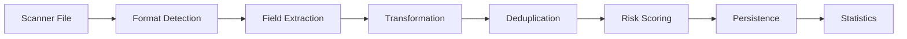

# Risk Radar Product Requirements Document (MVP)

## Table of Contents
1. [Executive Summary](#executive-summary)
2. [System Architecture](#system-architecture)
3. [Core Data Model](#core-data-model)
4. [Feature Specifications](#feature-specifications)
5. [Ingestion Architecture](#ingestion-architecture)
6. [Implementation Guide](#implementation-guide)
7. [Non-Functional Requirements](#non-functional-requirements)
8. [Appendices](#appendices)

---

## Executive Summary

Risk Radar is a comprehensive vulnerability management platform that consolidates security data from multiple sources, prioritises risks based on business context, and tracks remediation efforts. The platform uses a flexible, configuration-driven architecture that enables integration with any vulnerability scanner without code changes.

### Core Value Propositions
- **Multi-Scanner Support**: Integrate any vulnerability scanner through configuration, not code
- **Intelligent Deduplication**: Sophisticated asset and vulnerability correlation across sources
- **Business Context**: Risk scoring based on asset criticality and organisational structure
- **Remediation Tracking**: Campaign management with SLA enforcement and performance metrics
- **Extensibility**: Schema designed for evolution without migrations

---

## System Architecture

### Technical Stack
- **Database**: PostgreSQL (via Supabase) with JSONB for extensibility
- **Backend**: Django for business logic, admin interface, and API
- **Frontend**: lovable.dev for rapid UI development
- **Storage**: Supabase Storage for scanner files
- **Authentication**: Supabase Auth with JWT tokens

### Data Flow Architecture
```
┌─────────────────┐     ┌────────────────┐     ┌──────────────┐
│ Scanner Sources │────▶│ Ingestion      │────▶│ PostgreSQL   │
│ (Nessus, etc)  │     │ Pipeline       │     │ Database     │
└─────────────────┘     └────────────────┘     └──────────────┘
                               │                        │
                               ▼                        ▼
                        ┌────────────────┐      ┌──────────────┐
                        │ Field Mapping  │      │ REST API     │
                        │ & Normalisation│      │ (Django)     │
                        └────────────────┘      └──────────────┘
                                                       │
                                                       ▼
                                                ┌──────────────┐
                                                │ UI Layer     │
                                                │ (lovable.dev)│
                                                └──────────────┘
```

---

## Core Data Model

### Schema Overview
The schema centres on separate tables for assets, vulnerabilities, and findings to normalise data and avoid duplication. A scanner_integration table lists all configured integrations, while field_mapping and severity_mapping tables provide flexible mapping from vendor-specific fields and severity ratings to the internal schema.

### 3.1 Scanner Integration Table
```sql
CREATE TABLE scanner_integration (
    integration_id SERIAL PRIMARY KEY,
    name VARCHAR(100) NOT NULL UNIQUE,
    type VARCHAR(50) NOT NULL,               -- e.g., 'vuln_scanner', 'asset_inventory'
    description TEXT,
    active BOOLEAN DEFAULT TRUE
);
```

**Purpose**: Lists each external scanner integration configured in the system. This is the master registry of all data sources.

**Field Descriptions**:
- `integration_id`: Synthetic primary key used throughout the system
- `name`: Human-readable name (e.g., "Nessus", "Qualys VM", "CrowdStrike Falcon")
- `type`: Category of integration for future extensibility
- `description`: Optional text describing the integration or version
- `active`: Enables/disables data sync without removing configuration

### 3.2 Assets Table
```sql
CREATE TABLE assets (
    asset_id SERIAL PRIMARY KEY,
    hostname VARCHAR(255),
    ip_address INET,
    asset_type VARCHAR(50),         -- e.g., 'Server', 'Workstation', 'Container'
    operating_system VARCHAR(100),
    mac_address VARCHAR(50),
    extra JSONB,                    -- unstructured metadata (e.g., cloud IDs, tags)
    UNIQUE(hostname, ip_address)
);
```

**Purpose**: Stores unique IT assets discovered by scanners. Designed to aggregate data from multiple integrations while avoiding duplicates.

**Field Descriptions**:
- `hostname` / `ip_address`: Core identifiers. The unique constraint prevents exact duplicates, though sophisticated deduplication logic handles variations
- `asset_type`: High-level classification (Server, Workstation, Container, Cloud Resource)
- `operating_system`: Normalised OS name/version
- `mac_address`: Network interface identifier for correlation
- `extra`: JSONB field storing scanner-specific metadata without schema changes:
  - Cloud identifiers (AWS instance ID, Azure VM ID)
  - Agent UUIDs
  - Asset tags and labels
  - Scanner-specific attributes

**Deduplication Strategy**:
1. Cloud instance IDs (highest priority)
2. Agent UUIDs
3. MAC address + hostname
4. Hostname + primary IP
5. IP address only (lowest priority)

### 3.3 Vulnerabilities Table
```sql
CREATE TABLE vulnerabilities (
    vulnerability_id SERIAL PRIMARY KEY,
    cve_id VARCHAR(50),                     -- e.g., 'CVE-2023-12345'
    external_id VARCHAR(100),               -- scanner-specific vuln ID
    external_source VARCHAR(50),            -- source of external_id
    title TEXT NOT NULL,
    description TEXT,
    cvss_score NUMERIC(4,1),                -- CVSS base score 0.0-10.0
    severity_level SMALLINT,                -- normalised 0-10 scale
    severity_label VARCHAR(20),             -- normalised label
    fix_info TEXT,                          -- remediation advice
    published_at TIMESTAMPTZ,               -- vulnerability publication date
    modified_at TIMESTAMPTZ,                -- last update date
    extra JSONB,                            -- extensible metadata
    UNIQUE(cve_id),
    UNIQUE(external_source, external_id)
);
```

**Purpose**: Centralised vulnerability catalogue with normalised severity and deduplication support.

**Field Descriptions**:
- `cve_id`: Standard CVE identifier for cross-scanner deduplication
- `external_id` & `external_source`: Scanner-specific identifiers (e.g., Nessus pluginID, Qualys QID)
- `title`: Short, descriptive name
- `description`: Full vulnerability details
- `cvss_score`: Industry-standard severity metric
- `severity_level` & `severity_label`: Normalised internal severity (via severity_mapping)
- `fix_info`: Remediation instructions
- `published_at` / `modified_at`: Temporal tracking
- `extra`: JSONB for extensible data:
  - Exploit availability flags
  - Reference URLs (BID, OSVDB, vendor advisories)
  - CWE IDs
  - Scanner-specific metadata

### 3.4 Findings Table
```sql
CREATE TABLE findings (
    finding_id SERIAL PRIMARY KEY,
    asset_id INTEGER NOT NULL REFERENCES assets(asset_id) ON DELETE CASCADE,
    vulnerability_id INTEGER NOT NULL REFERENCES vulnerabilities(vulnerability_id) ON DELETE CASCADE,
    integration_id INTEGER NOT NULL REFERENCES scanner_integration(integration_id) ON DELETE CASCADE,
    first_seen TIMESTAMP,
    last_seen TIMESTAMP,
    fixed_at TIMESTAMP,
    status VARCHAR(20) DEFAULT 'open',      -- 'open', 'fixed', 'risk_accepted'
    severity_level SMALLINT,                -- normalised severity at finding level
    port VARCHAR(10),                       -- network port if applicable
    protocol VARCHAR(10),                   -- protocol if applicable
    service VARCHAR(100),                   -- service name
    risk_score NUMERIC(5,2),                -- calculated risk score
    details JSONB,                          -- scanner evidence & metadata
    UNIQUE(asset_id, vulnerability_id, integration_id, port, protocol, service)
);
```

**Purpose**: Links vulnerabilities to assets with full context. Supports multiple scanners reporting the same issue.

**Field Descriptions**:
- `asset_id` / `vulnerability_id` / `integration_id`: Core relationships
- `first_seen` / `last_seen` / `fixed_at`: Temporal tracking for MTTR
- `status`: Lifecycle management (open → fixed/risk_accepted)
- `severity_level`: Can differ from vulnerability severity based on context
- `port` / `protocol` / `service`: Network context for service-specific vulnerabilities
- `risk_score`: Calculated based on severity, asset criticality, and threat intelligence
- `details`: JSONB for scanner-specific evidence:
  - Plugin output (Nessus)
  - Vulnerability test results (Qualys)
  - File paths (CrowdStrike)
  - Registry keys (Defender)

### 3.5 Field Mapping Table
```sql
CREATE TABLE field_mapping (
    mapping_id SERIAL PRIMARY KEY,
    integration_id INTEGER NOT NULL REFERENCES scanner_integration(integration_id) ON DELETE CASCADE,
    source_field VARCHAR(200) NOT NULL,     -- Scanner field name/path
    target_model VARCHAR(50) NOT NULL,      -- 'assets', 'vulnerabilities', 'findings'
    target_field VARCHAR(100) NOT NULL,     -- Model field or JSON path
    field_type VARCHAR(20) DEFAULT 'string',
    transformation VARCHAR(500),            -- Python expression or function
    default_value TEXT,
    is_required BOOLEAN DEFAULT FALSE,
    is_active BOOLEAN DEFAULT TRUE,
    sort_order INTEGER DEFAULT 0,
    UNIQUE (integration_id, source_field, target_model, target_field)
);
```

**Purpose**: Configuration-driven field extraction and transformation. Enables no-code scanner integration.

**Field Descriptions**:
- `source_field`: Exact field name from scanner (XML tag, JSON key, CSV column)
- `target_model` / `target_field`: Destination in internal schema
- `field_type`: Data type for conversion (string, integer, decimal, boolean, json, datetime)
- `transformation`: Python expression for complex mappings:
  - `value.lower()` - Convert to lowercase
  - `value.split(',')[0]` - Extract first element
  - `severity_map` - Use severity mapping table
- `default_value`: Fallback for missing data
- `sort_order`: Process fields in specific order for dependencies

### 3.6 Severity Mapping Table
```sql
CREATE TABLE severity_mapping (
    severity_mapping_id SERIAL PRIMARY KEY,
    integration_id INTEGER NOT NULL REFERENCES scanner_integration(integration_id) ON DELETE CASCADE,
    external_severity VARCHAR(50) NOT NULL,
    internal_severity_level SMALLINT NOT NULL,
    internal_severity_label VARCHAR(20) NOT NULL,
    UNIQUE(integration_id, external_severity)
);
```

**Purpose**: Normalises different scanner severity scales to consistent internal ratings.

### Schema Validation

#### Multi-Scanner Support Validation
The schema design has been validated against [Vulcan Cyber's](https://help.vulcancyber.com/) connector documentation for major vulnerability scanners:
- ✅ **Qualys VM** - All required fields mappable
- ✅ **Tenable.io/Nessus** - Complete field coverage confirmed
- ✅ **CrowdStrike Falcon** - Agent-based findings supported
- ✅ **Microsoft Defender VM** - Host vulnerability data compatible

#### Key Validation Findings
1. **Identification Strategy**: Our multi-identifier approach (cloud ID → agent UUID → MAC → hostname → IP) matches industry best practices
2. **JSONB Flexibility**: Aligns with Vulcan's approach for handling vendor-specific fields without schema changes
3. **Normalisation Framework**: field_mapping and severity_mapping tables enable configuration-driven integration
4. **Nessus MVP**: All fields from the [Nessus file format](https://docs.tenable.com/quick-reference/nessus-file-format/Nessus-File-Format.pdf) are fully supported

The schema is **production-ready** for the MVP and future scanner integrations.

---

## Feature Specifications

### 4.1 Asset Management & Deduplication

#### Deduplication Algorithm
```python
# Pseudocode for asset deduplication
def deduplicate_asset(incoming_asset):
    # Priority 1: Cloud instance ID
    if incoming_asset.cloud_instance_id:
        existing = find_by_cloud_id(incoming_asset.cloud_instance_id)
        if existing:
            return merge_assets(existing, incoming_asset)
    
    # Priority 2: Agent UUID
    if incoming_asset.agent_uuid:
        existing = find_by_agent_uuid(incoming_asset.agent_uuid)
        if existing:
            return merge_assets(existing, incoming_asset)
    
    # Priority 3: MAC + Hostname
    if incoming_asset.mac_address and incoming_asset.hostname:
        existing = find_by_mac_hostname(incoming_asset.mac_address, 
                                       incoming_asset.hostname)
        if existing:
            return merge_assets(existing, incoming_asset)
    
    # Priority 4: Hostname + IP
    if incoming_asset.hostname and incoming_asset.ip_address:
        existing = find_by_hostname_ip(incoming_asset.hostname, 
                                     incoming_asset.ip_address)
        if existing:
            return merge_assets(existing, incoming_asset)
    
    # Priority 5: IP only
    if incoming_asset.ip_address:
        existing = find_by_ip(incoming_asset.ip_address)
        if existing and not existing.hostname:  # Only merge if no hostname
            return merge_assets(existing, incoming_asset)
    
    # No match found - create new asset
    return create_asset(incoming_asset)
```

#### Proactive Detach
A scheduled job continuously evaluates merged assets for identifier conflicts:
- If hostname now points to different cloud ID → split asset
- If MAC address moves to different hostname → split asset
- Findings are reallocated to maintain data integrity

### 4.2 Vulnerability Management

#### Vulnerability Deduplication
- **CVE-based**: All findings with same CVE map to single vulnerability record
- **Scanner-specific**: (external_source, external_id) prevents duplicates from same scanner
- **Cross-scanner**: Manual mapping or pattern matching for non-CVE issues

#### Severity Normalisation
Internal 0-10 scale with standard labels:
- 10 = Critical
- 8 = High  
- 5 = Medium
- 3 = Low
- 0 = Informational

### 4.3 Risk Scoring

#### Formula
```
Risk Score = (Severity × 0.45) + (Threat × 0.35) + (Impact × 0.20)

Where:
- Severity = Normalised vulnerability severity (0-10)
- Threat = Exploit availability and active exploitation (0-10)
- Impact = Asset criticality × exposure factor (0-10)
```

### 4.4 SLA Management

#### Policy Configuration
```json
{
  "business_group": "Production",
  "sla_days": {
    "Critical": 1,
    "High": 7,
    "Medium": 30,
    "Low": 90,
    "Info": 365
  }
}
```

#### Compliance Tracking
- **Compliant**: Within SLA window
- **At Risk**: > 80% of SLA consumed
- **Breached**: Past due date

### 4.5 Remediation Campaigns

#### Campaign Lifecycle
1. Create campaign with finding selection criteria
2. Optional: Generate JIRA/ServiceNow tickets
3. Track progress as findings are marked fixed
4. Auto-close when all findings remediated

### 4.6 Remediation Performance Reporting

Based on industry-standard KPIs, the platform provides comprehensive remediation performance metrics with multi-dimensional filtering and trend analysis.

#### Core KPIs

##### MTTR (Mean Time to Remediate)
- **Definition**: Average days from first_seen to fixed_at
- **Calculation**: `AVG(fixed_at - first_seen)` for findings with status='fixed'
- **Dimensions**:
  - Overall organisation MTTR
  - By Business Group
  - By Risk Level (Critical, High, Medium, Low)
  - By Asset Type
  - Over time (daily/weekly/monthly trends)
- **Target**: Lower MTTR indicates better performance

##### Average Daily Remediation
- **Definition**: Average count of findings fixed per day
- **Calculation**: `COUNT(findings WHERE fixed_at = date) / days in period`
- **Dimensions**:
  - By Business Group (with ranking)
  - By Risk Level
  - By Asset Type
- **Target**: Higher count indicates better throughput

##### Remediation Capacity
- **Definition**: Percentage of introduced findings that are remediated
- **Calculation**: `(Avg Daily Remediated / Avg Daily Introduced) × 100`
- **Dimensions**:
  - Overall capacity percentage
  - By Risk Level
  - By Asset Type
- **Target**: ≥100% indicates keeping pace with new findings

> **Note**: Campaign Coverage metrics are excluded from MVP as campaign management is not in initial scope.

#### SLA Compliance Reporting

##### Assets Compliant with SLA
- **Definition**: Percentage of assets meeting SLA requirements
- **Calculation**: Assets with all findings within SLA window
- **Dimensions**:
  - By Business Group
  - By Risk Level
  - Trend over time

##### Findings Exceeding SLA
- **Percentage View**: `(Findings past due / Total findings) × 100`
- **Count View**: Absolute number of breached findings
- **Dimensions**:
  - By Business Group
  - By Risk Level
  - By Days Overdue (1-7, 8-30, 31-90, >90)

#### Filtering & Time Ranges

##### Standard Time Periods
- Last 7 days
- Last 30 days
- Last 90 days
- Last 1 year
- All time

##### Trend Comparisons
For each metric and time period:
- **Current Period Value**: The metric for selected period
- **Previous Period Value**: Same metric for equivalent previous period
- **Trend Percentage**: `((Current - Previous) / Previous) × 100`
- **Trend Direction**: Improving ↓, Worsening ↑, or Stable →

##### Filter Combinations
All metrics support filtering by:
- Business Group (single or multiple)
- Risk Level (single or multiple)
- Asset Type (single or multiple)
- Date Range (with custom date selection)
- Finding Status (for applicable metrics)

#### Report Views

##### Executive Dashboard
```
┌─────────────────────────────────────────────────────────┐
│ MTTR: 15.5 days ↓12%  │ Daily Remediation: 142 ↑8%     │
│ Capacity: 95% ↓2%     │ SLA Compliance: 87% ↑5%        │
└─────────────────────────────────────────────────────────┘

┌─────────────────────────┬───────────────────────────────┐
│ MTTR by Business Group  │ Remediation Capacity by Risk  │
│ [Bar Chart]             │ [Stacked Bar Chart]           │
└─────────────────────────┴───────────────────────────────┘

┌─────────────────────────────────────────────────────────┐
│ MTTR Trend (Last 90 Days)                               │
│ [Line Chart with Critical/High/Medium/Low]              │
└─────────────────────────────────────────────────────────┘
```

##### Operational Reports
- **MTTR Deep Dive**: Detailed breakdown by all dimensions
- **Remediation Velocity**: Daily fix rates with capacity analysis
- **SLA Breach Report**: Actionable list of overdue findings
- **Business Group Scorecard**: Comparative performance metrics

---

## Ingestion Architecture

### 5.1 Processing Pipeline



### 5.2 Field Mapping Examples

#### Nessus to Risk Radar
```sql
-- Asset mappings
INSERT INTO field_mapping (integration_id, source_field, target_model, target_field) VALUES
(1, 'HostName', 'assets', 'hostname'),
(1, 'host-ip', 'assets', 'ip_address'),
(1, 'operating-system', 'assets', 'operating_system'),
(1, 'mac-address', 'assets', 'mac_address'),
(1, 'netbios-name', 'assets', 'extra.netbios_name'),
(1, 'host-fqdn', 'assets', 'extra.fqdn');

-- Vulnerability mappings
INSERT INTO field_mapping (integration_id, source_field, target_model, target_field, transformation) VALUES
(1, '@pluginID', 'vulnerabilities', 'external_id', NULL),
(1, '@pluginName', 'vulnerabilities', 'title', NULL),
(1, 'synopsis', 'vulnerabilities', 'extra.synopsis', NULL),
(1, 'description', 'vulnerabilities', 'description', NULL),
(1, 'solution', 'vulnerabilities', 'fix_info', NULL),
(1, '@severity', 'vulnerabilities', 'severity_level', 'severity_map'),
(1, 'risk_factor', 'vulnerabilities', 'extra.risk_factor', NULL),
(1, 'pluginFamily', 'vulnerabilities', 'extra.plugin_family', NULL);

-- CVE and Reference mappings
INSERT INTO field_mapping (integration_id, source_field, target_model, target_field, transformation) VALUES
(1, 'cve', 'vulnerabilities', 'cve_id', 'first'),  -- Take first CVE if multiple
(1, 'cve', 'vulnerabilities', 'extra.references.cve', 'list'),
(1, 'bid', 'vulnerabilities', 'extra.references.bid', 'list'),
(1, 'xref', 'vulnerabilities', 'extra.references.xref', 'list'),
(1, 'see_also', 'vulnerabilities', 'extra.references.see_also', 'list');

-- CVSS mappings
INSERT INTO field_mapping (integration_id, source_field, target_model, target_field) VALUES
(1, 'cvss_base_score', 'vulnerabilities', 'cvss_score', NULL),
(1, 'cvss_vector', 'vulnerabilities', 'extra.cvss.vector', NULL),
(1, 'cvss_temporal_score', 'vulnerabilities', 'extra.cvss.temporal_score', NULL),
(1, 'cvss_temporal_vector', 'vulnerabilities', 'extra.cvss.temporal_vector', NULL),
(1, 'cvss3_base_score', 'vulnerabilities', 'extra.cvss.cvss3_base_score', NULL),
(1, 'cvss3_vector', 'vulnerabilities', 'extra.cvss.cvss3_vector', NULL);

-- Exploit mappings
INSERT INTO field_mapping (integration_id, source_field, target_model, target_field) VALUES
(1, 'exploitability_ease', 'vulnerabilities', 'extra.exploit.exploitability_ease', NULL),
(1, 'exploit_available', 'vulnerabilities', 'extra.exploit.exploit_available', 'boolean'),
(1, 'exploit_framework_canvas', 'vulnerabilities', 'extra.exploit.canvas', 'boolean'),
(1, 'exploit_framework_metasploit', 'vulnerabilities', 'extra.exploit.metasploit', 'boolean'),
(1, 'exploit_framework_core', 'vulnerabilities', 'extra.exploit.core', 'boolean'),
(1, 'exploited_by_malware', 'vulnerabilities', 'extra.exploit.exploited_by_malware', 'boolean'),
(1, 'metasploit_name', 'vulnerabilities', 'extra.exploit.metasploit_name', NULL),
(1, 'canvas_package', 'vulnerabilities', 'extra.exploit.canvas_package', NULL);

-- Date mappings
INSERT INTO field_mapping (integration_id, source_field, target_model, target_field, transformation) VALUES
(1, 'vuln_publication_date', 'vulnerabilities', 'published_at', 'parse_date'),
(1, 'plugin_modification_date', 'vulnerabilities', 'modified_at', 'parse_date'),
(1, 'plugin_publication_date', 'vulnerabilities', 'extra.plugin_publication_date', 'parse_date'),
(1, 'patch_publication_date', 'vulnerabilities', 'extra.patch_publication_date', 'parse_date');

-- Finding mappings
INSERT INTO field_mapping (integration_id, source_field, target_model, target_field, transformation) VALUES
(1, '@port', 'findings', 'port', NULL),
(1, '@protocol', 'findings', 'protocol', NULL),
(1, '@svc_name', 'findings', 'service', NULL),
(1, 'plugin_output', 'findings', 'details.plugin_output', NULL),
(1, 'plugin_type', 'findings', 'details.plugin_type', NULL),
(1, 'script_version', 'findings', 'details.script_version', NULL);
```

#### Qualys to Risk Radar
```sql
-- Similar structure with Qualys-specific fields
INSERT INTO field_mapping (integration_id, source_field, target_model, target_field) VALUES
(2, 'QID', 'vulnerabilities', 'external_id'),
(2, 'IP', 'assets', 'ip_address'),
(2, 'DNS', 'assets', 'hostname'),
(2, 'OS', 'assets', 'operating_system');
```

### 5.3 Severity Mapping Examples

#### Nessus Severity Mapping
```sql
INSERT INTO severity_mapping (integration_id, external_severity, internal_severity_level, internal_severity_label) VALUES
(1, '4', 10, 'Critical'),
(1, '3', 8, 'High'),
(1, '2', 5, 'Medium'),
(1, '1', 3, 'Low'),
(1, '0', 0, 'Informational');
```

#### Qualys Severity Mapping
```sql
INSERT INTO severity_mapping (integration_id, external_severity, internal_severity_level, internal_severity_label) VALUES
(2, '5', 10, 'Critical'),
(2, '4', 8, 'High'),
(2, '3', 5, 'Medium'),
(2, '2', 3, 'Low'),
(2, '1', 1, 'Informational');
```

---

## Implementation Guide

### 6.1 Phase 1: Core Platform (MVP)
- Scanner integration framework with Nessus support
- Asset and vulnerability management with deduplication
- Basic finding lifecycle (open → fixed)
- Business groups and SLA policies
- Django admin for configuration

### 6.2 Phase 2: Advanced Features
- Additional scanner integrations (Qualys, CrowdStrike, Defender)
- Remediation campaigns with ticket integration
- Performance metrics (MTTR, velocity, capacity)
- REST API implementation
- lovable.dev UI integration

### 6.3 Phase 3: Enterprise Features
- SSO integration (SAML, OIDC)
- Advanced RBAC with field-level permissions
- Automated workflows and playbooks
- Custom reporting builder
- Multi-tenancy support

---

## Non-Functional Requirements

### Performance
- **Data ingestion**: Process 100,000 findings in under 15 minutes
- **Query response**: Sub-second response for filtered finding lists
- **Concurrent users**: Support 100+ simultaneous users
- **Real-time updates**: Instant reflection of status changes

### Scalability
- **Horizontal scaling**: Stateless API servers
- **Database optimisation**: Proper indexing on foreign keys and commonly queried fields
- **Batch processing**: Chunked processing for large files
- **Archive strategy**: Move closed findings to archive tables after 90 days

### Security
- **Encryption at rest**: All sensitive fields encrypted
- **Encryption in transit**: TLS 1.2+ mandatory
- **Authentication**: JWT tokens with 1-hour expiry
- **Audit logging**: Every create/update/delete logged with user context

### Reliability
- **Availability**: 99.5% monthly uptime
- **Backup**: Daily automated backups with 30-day retention
- **Recovery**: RPO < 24 hours, RTO < 4 hours
- **Monitoring**: Application and infrastructure metrics

---

## Appendices

### A. Example Nessus XML Structure
```xml
<NessusClientData_v2>
  <Report>
    <ReportHost name="192.168.1.100">
      <HostProperties>
        <tag name="host-ip">192.168.1.100</tag>
        <tag name="host-fqdn">server.example.com</tag>
        <tag name="operating-system">Microsoft Windows Server 2019</tag>
        <tag name="mac-address">00:50:56:94:5a:34</tag>
      </HostProperties>
      <ReportItem port="445" svc_name="cifs" protocol="tcp" severity="3" pluginID="57582">
        <pluginName>SMB Signing not required</pluginName>
        <cve>CVE-2023-12345</cve>
        <cvss_base_score>7.5</cvss_base_score>
        <description>The remote SMB server does not require signing...</description>
        <solution>Enforce message signing in the host's configuration...</solution>
        <plugin_output>The remote host is missing a security update...</plugin_output>
      </ReportItem>
    </ReportHost>
  </Report>
</NessusClientData_v2>
```

### B. JSONB Usage Examples

#### Asset Extra Field
```json
{
  "cloud_instance_id": "i-1234567890abcdef0",
  "agent_uuid": "550e8400-e29b-41d4-a716-446655440000",
  "tags": ["production", "web-server", "pci-scope"],
  "last_scan_date": "2024-01-15T10:30:00Z",
  "scanner_metadata": {
    "nessus_host_id": "12345",
    "qualys_asset_id": "67890"
  }
}
```

#### Finding Details Field
```json
{
  "plugin_output": "The remote host is missing security update KB5021089...",
  "evidence": {
    "vulnerable_software": "Apache 2.4.41",
    "installed_path": "/usr/local/apache2",
    "configuration_issue": "SSLProtocol allows TLSv1.0"
  },
  "scanner_specific": {
    "nessus_plugin_family": "Web Servers",
    "exploit_framework_metasploit": true,
    "cvss_temporal_score": 6.5
  }
}
```

### C. Performance Optimisation

#### Recommended Indexes
```sql
-- Assets
CREATE INDEX idx_assets_hostname ON assets(hostname);
CREATE INDEX idx_assets_ip ON assets(ip_address);
CREATE INDEX idx_assets_extra_cloud ON assets((extra->>'cloud_instance_id'));

-- Findings
CREATE INDEX idx_findings_status ON findings(status) WHERE status = 'open';
CREATE INDEX idx_findings_asset_vuln ON findings(asset_id, vulnerability_id);
CREATE INDEX idx_findings_integration ON findings(integration_id);
CREATE INDEX idx_findings_severity ON findings(severity_level);
CREATE INDEX idx_findings_first_seen ON findings(first_seen);

-- Vulnerabilities
CREATE INDEX idx_vulnerabilities_cve ON vulnerabilities(cve_id);
CREATE INDEX idx_vulnerabilities_external ON vulnerabilities(external_source, external_id);
```

### D. API Endpoints

```
# Assets
GET    /api/v1/assets/              # List assets with filtering
POST   /api/v1/assets/              # Create asset
GET    /api/v1/assets/{id}/         # Get asset details
PUT    /api/v1/assets/{id}/         # Update asset
DELETE /api/v1/assets/{id}/         # Delete asset
POST   /api/v1/assets/merge/        # Merge duplicate assets

# Vulnerabilities
GET    /api/v1/vulnerabilities/     # List vulnerabilities
GET    /api/v1/vulnerabilities/{id}/# Get vulnerability details

# Findings
GET    /api/v1/findings/            # List findings with filtering
PUT    /api/v1/findings/{id}/       # Update finding status
POST   /api/v1/findings/bulk/       # Bulk status update

# Campaigns
POST   /api/v1/campaigns/           # Create campaign
GET    /api/v1/campaigns/{id}/      # Get campaign progress
POST   /api/v1/campaigns/{id}/close # Close campaign

# Metrics
GET    /api/v1/metrics/mttr/        # MTTR by group/severity
GET    /api/v1/metrics/velocity/    # Remediation velocity
GET    /api/v1/metrics/capacity/    # Remediation capacity
GET    /api/v1/metrics/sla/         # SLA compliance

# Ingestion
POST   /api/v1/ingest/upload/       # Upload scanner file
GET    /api/v1/ingest/status/{id}/  # Check import status
```

---

*End of Product Requirements Document*

> **Note**: For detailed database schemas, field mappings, and comprehensive scanner integration documentation, see [Risk Radar Vulnerability Ingestion Schema](./docs/risk_radar_vulnerability_ingestion_schema.md)